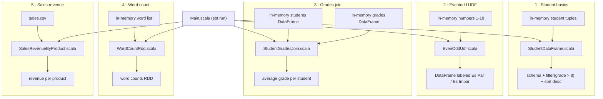

# spark-batch-processing

Five Apache Spark batch-processing jobs in Scala — DataFrame basics, a UDF,
a join with aggregation, an RDD word count, and a CSV revenue report — run
locally with no cluster required.

This started as a bootcamp exam ("examen"), written in a single file with
`Ejercicio1`..`Ejercicio5` naming. It's been restructured into a normal sbt
project with named jobs, a real entry point, and a test suite that asserts
on results instead of just printing them — no disclaimers needed for that
origin, the code speaks for itself now.

## Pipeline



## Project structure

```
spark-batch-processing/
├── build.sbt                                # Scala 2.12.20, Spark 3.5.8, JDK 17 --add-opens flags
├── project/
│   └── build.properties                     # pins sbt 1.10.5
├── src/
│   ├── main/
│   │   ├── resources/
│   │   │   └── sales.csv                    # sample sales fixture, committed - no external dependency
│   │   └── scala/exercises/
│   │       ├── StudentDataFrame.scala       # job 1: schema/filter/sort on a DataFrame
│   │       ├── EvenOddUdf.scala             # job 2: UDF labeling numbers even/odd
│   │       ├── StudentGradesJoin.scala      # job 3: join + average grade per student
│   │       ├── WordCountRdd.scala           # job 4: RDD word count
│   │       ├── SalesRevenueByProduct.scala  # job 5: revenue per product from sales.csv
│   │       └── Main.scala                   # entry point, runs all five jobs (`sbt run`)
│   └── test/
│       └── scala/
│           ├── exercises/                   # one *Spec.scala per job, with real assertions
│           └── utils/
│               └── TestInit.scala           # shared local-SparkSession test fixture
└── README.md
```

## Prerequisites

- **JDK 17** — built and tested against [Eclipse Temurin 17.0.19](https://adoptium.net/temurin/releases/?version=17).
  Spark 3.5.x requires Java 17 as its minimum supported version.
- **sbt 1.10.5+** — the exact version is pinned in `project/build.properties`
  and any sbt launcher bootstraps it automatically. Install via the
  [official sbt instructions](https://www.scala-sbt.org/download.html)
  (`brew install sbt`, `choco install sbt`, `sdk install sbt`, or the
  standalone installer).
- Nothing else: no Spark cluster, no Hadoop install, no database. Everything
  runs against a local `local[*]` SparkSession and a CSV fixture committed in
  the repo (`src/main/resources/sales.csv`).

On Windows you'll see a harmless `WARN Shell: Did not find winutils.exe` the
first time Spark starts — that's Hadoop's native-IO shim, unused for local
CSV/DataFrame work, and safe to ignore.

## Quickstart

```
git clone https://github.com/Shantiago27/spark-batch-processing.git
cd spark-batch-processing
sbt compile
sbt test
sbt run
```

Every command above was run against a clean clone of this repo while
preparing it; the output below is copied from those runs, not invented.

## What each job does

**1 · StudentDataFrame** — builds a DataFrame of students, prints its schema,
filters grades > 8, sorts by grade descending.

```
Estudiantes con calificación > 8:
+---------+----+------------+
|   nombre|edad|calificacion|
+---------+----+------------+
|    Maria|  22|         8.5|
|      Ana|  23|         8.7|
|    Laura|  29|         9.3|
|  Daniela|  25|         9.4|
|   Carmen|  24|         8.8|
|   Monica|  23|         9.0|
|     Sara|  26|         8.9|
|Alejandra|  20|         9.2|
|  Ricardo|  23|         8.3|
| Victoria|  28|         8.4|
+---------+----+------------+
```

**2 · EvenOddUdf** — a UDF that labels each number in a column even/odd.

```
+------+---------+
|numero|par_impar|
+------+---------+
|     1| Es Impar|
|     2|   Es Par|
|     3| Es Impar|
|     4|   Es Par|
|     5| Es Impar|
|     6|   Es Par|
|     7| Es Impar|
|     8|   Es Par|
|     9| Es Impar|
|    10|   Es Par|
+------+---------+
```

**3 · StudentGradesJoin** — joins students with their grades and averages
grades per student.

```
+---+------+---------------------+
| id|nombre|Calificacion Promedio|
+---+------+---------------------+
|  1|  Juan|                 8.75|
|  2|   Ana|                 7.15|
|  3|  Luis|                  8.6|
+---+------+---------------------+
```

**4 · WordCountRdd** — counts word occurrences in a list using the RDD API.

```
(cometa,3)
(planeta,3)
(estrella,2)
(luna,2)
(sol,1)
(galaxia,1)
```

**5 · SalesRevenueByProduct** — loads `sales.csv` and computes total revenue
(`cantidad * precio_unitario`) per product.

```
+-----------+-------------+
|id_producto|ingreso_total|
+-----------+-------------+
|        108|        486.0|
|        101|        460.0|
|        103|        280.0|
|        107|        396.0|
|        102|        405.0|
|        109|        540.0|
|        105|        570.0|
|        110|        494.0|
|        106|        425.0|
|        104|        800.0|
+-----------+-------------+
```

`sbt compile` and `sbt test` on this repo:

```
[info] compiling 6 Scala sources to .../target/scala-2.12/classes ...
[success] Total time: 23 s

[info] Total number of tests run: 5
[info] Suites: completed 6, aborted 0
[info] Tests: succeeded 5, failed 0, canceled 0, ignored 0, pending 0
```

## Technical decisions

- **Spark 3.5.8 / Scala 2.12.20**, not the originally pinned Spark 3.2.4.
  Spark 3.2 doesn't support Java 17: running it embedded (not via
  `spark-submit`, which injects its own JVM flags) crashed every test with
  `java.lang.IllegalAccessError: ... cannot access class sun.nio.ch.DirectBuffer`.
  Spark 3.5.x is the first 3.x line with official Java 17 support and still
  publishes Scala 2.12 artifacts, so it's a version bump with no code changes
  required. Scala stayed on 2.12 rather than jumping to 2.13 — nothing in the
  code needs it, and changing it would've been an unforced second variable in
  the same upgrade.
- **No cluster, by design.** Every job builds its own small in-memory dataset
  (or reads the one committed CSV) against `SparkSession.builder().master("local[*]")`.
  That's what makes `sbt run`/`sbt test` reproducible on a laptop with no
  external services — the point of these exercises is the Spark API, not
  infrastructure.
- **`build.sbt` sets `fork := true` plus the `--add-opens` flags** Spark needs
  on Java 9+, for both `run` and `test`. spark-submit's launch scripts add
  these automatically; running Spark embedded from sbt doesn't, so without
  them the JDK 17 crash above happens regardless of Spark version. Baking the
  flags into the build means nobody has to remember to pass them by hand.
- **CSV path is project-root-relative**, not a classpath resource. The first
  attempt loaded `sales.csv` via `getClass.getResource(...)`, which works
  under `sbt test` (classes run from an exploded directory) but breaks under
  `sbt run`'s forked/packaged classloader, which resolves it as a `jar:` URI
  that Spark's Hadoop-based CSV reader can't open. sbt fixes the working
  directory of both `run` and `test` at the project root, so a plain relative
  path (`src/main/resources/sales.csv`) resolves the same way regardless of
  machine or OS — no absolute paths, no string concatenation.
- **`.gitignore` added for build/IDE artifacts.** The original repo had
  compiled bytecode from *two different Scala versions* (`target/scala-2.12`
  and a stray `target/scala-3.3.4`) and a full IntelliJ `.idea/`/`.bsp/`
  directory committed — including `.bsp/sbt.json` with a hardcoded path from
  a different machine. None of that belongs in version control.
- **Project flattened to the repo root.** It used to live one level down in
  `examen/`, so every command needed an undocumented `cd examen` first.
